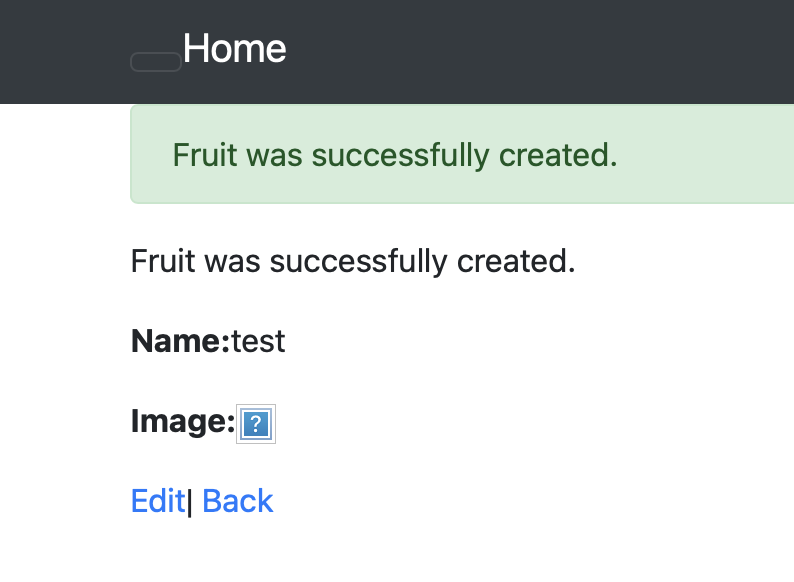
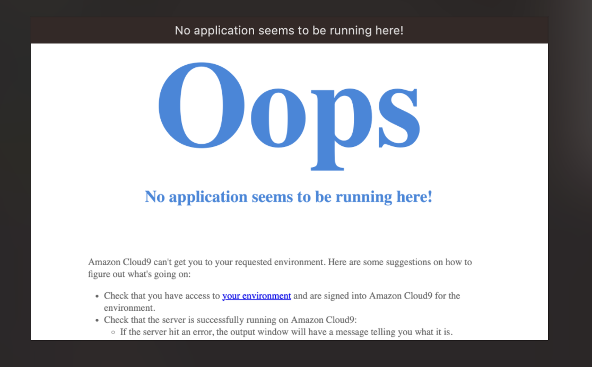
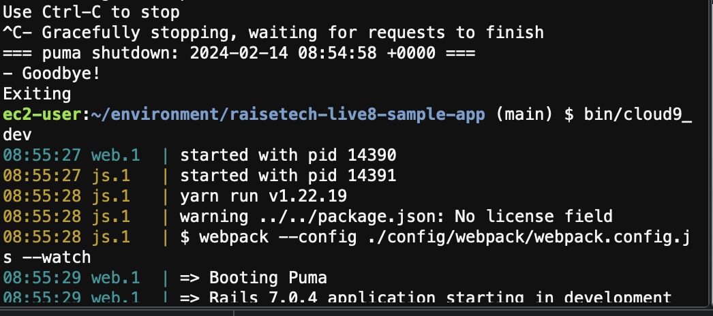

# 第３回講義課題
## 2023年2月受講
#### 1. サンプルアプリケーションのデプロイ

#### 2. APサーバーについて
- puma  ver. 5.6.8
- APサーバーの終了と再起動

- Railsの構成管理ツールはBundler

#### 今回の課題の所感
デプロイの過程でMySQLのPWを間違えてymlファイルに記入しており、解決に１週間ほどを要した。
その過程でコマンドやエラーの解釈や、バージョンのセットアップ作業の反芻など、得られるものは多かったが、
現場に出た時は、無用に時間を浪費してしまう凡ミスには気をつけたい。
